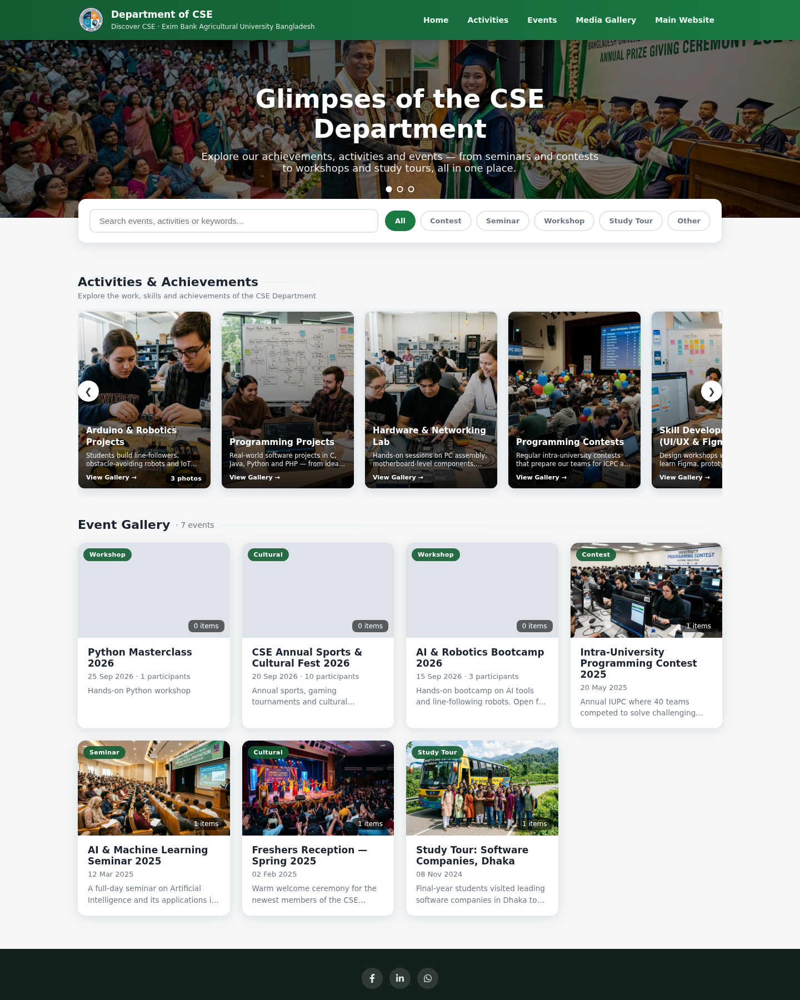
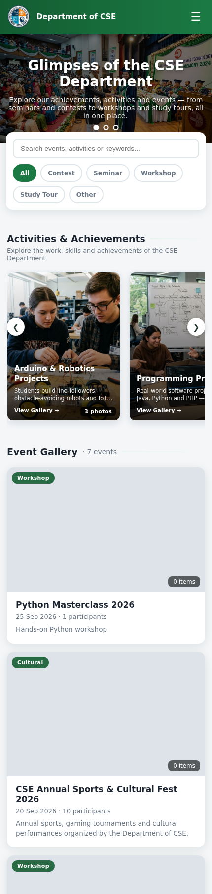

# EBAUB CSE Department — Event & Media Management System

A responsive PHP application for managing Department of CSE events, registrations, activities and media at **Exim Bank Agricultural University Bangladesh (EBAUB)**. Visitors browse the public gallery; teachers manage content through a protected admin panel.

<p align="center">
  
</p>

<p align="center">
  
  
  
</p>

## Product Preview

The screenshots below are captured from the running site with the bundled demo content. The phone-sized view shows the responsive mobile layout.

<p align="center">
  
  
</p>

## Project Context

| | |
|---|---|
| **Department** | Computer Science & Engineering, EBAUB |
| **Institution** | Exim Bank Agricultural University Bangladesh, Chapainawabganj |
| **Purpose** | Publish department events, registrations, achievements and media |
| **Application type** | PHP website with a teacher/admin management panel |

## What the System Does

### Public website

- **Home and Event Gallery** — rotating hero images, keyword search, event-category filters, activity highlights and past-event cards.
- **Upcoming Events** — upcoming event listings with registration status and deadlines.
- **Event details** — event description, photo/video gallery, lightbox, participation list and online registration when registration is open.
- **Activities & Achievements** — dedicated pages for labs, projects, contests and other department work, with location, facilities, assigned persons and multiple photos.
- **All Media** — a combined photo/video gallery for event and activity media, with filters and pagination.
- **Responsive navigation** — desktop navigation and a mobile hamburger menu; layouts adapt for phones, tablets and desktops.
- **Search and sharing metadata** — page descriptions, canonical URLs and Open Graph/Twitter Card metadata for public pages.

### Teacher/admin panel

- **Event management** — create, edit and remove events, set registration deadlines and manage the homepage slider.
- **Flexible registration forms** — add student dropdown questions, mark a question as the participant-group heading and show a question only when another answer matches a selected value. Students can use a one-time edit link to correct their registration before the deadline.
- **Registration management** — view participants, make further admin-side corrections and export registrations as CSV.
- **Media management** — upload multiple photos/videos, choose a cover image and arrange the display order.
- **Activity management** — publish or hide activities and manage their details and photo galleries.
- **Storage monitor and account security** — view storage use and change the admin password from the account page.

### Event lifecycle

1. A teacher creates an event and optionally sets a registration deadline and custom student questions.
2. Students or teachers register on the event page while registration is open.
3. Teachers manage the event's media and participant list from the admin panel.
4. On the event date, the event automatically moves from **Upcoming Events** to the **Event Gallery**.

## Pages and Files

| Page | File | Access |
|---|---|---|
| Home / Event Gallery | `index.php` | Public |
| Activities & Achievements | `activities.php` | Public |
| Upcoming Events | `upcoming.php` | Public |
| Event details, registration and media | `event.php?id=...` | Public |
| Combined Media Gallery | `all-media.php` | Public |
| Admin dashboard and event setup | `admin/dashboard.php` | Teachers/admins |
| Event photo/video manager | `admin/media.php` | Teachers/admins |
| Activity manager | `admin/activities.php` | Teachers/admins |
| Registrations and CSV export | `admin/registrations.php` | Teachers/admins |
| Admin registration correction | `admin/edit-registration.php` | Teachers/admins |
| Account / change password | `admin/change-password.php` | Teachers/admins |

## Technology

- **PHP 8+** with PDO
- **SQLite** for the included local demo database; **MySQL** for XAMPP or hosted deployment
- HTML, CSS and vanilla JavaScript — no frontend framework or build step
- **PHP GD recommended** for image resizing and WebP compression; uploads fall back gracefully when the needed GD/WebP functions are unavailable

## Run Locally with XAMPP

### Requirements

- XAMPP with PHP 8 or newer and Apache
- `pdo_sqlite` enabled for the default local demo
- PHP GD recommended for image processing

### Quick start — SQLite demo

1. Get the project source. For example:

   ```bash
   git clone https://github.com/MaksBloxX/cse-gallary.git cse-gallery
   ```

   You can also download the repository as a ZIP.
2. Copy the project folder into XAMPP's `htdocs` directory. For the current Windows setup, use:

   ```text
   D:\Program Files\XMDL\htdocs\cse-gallery
   ```

   A standard XAMPP installation might use `C:\xampp\htdocs\cse-gallery` instead.
3. Open XAMPP Control Panel and start **Apache**. The bundled demo uses SQLite, so MySQL does not need to be started for this mode.
4. Visit **<http://localhost/cse-gallery/>**.
5. To reach the admin login, click the **©** symbol in the site footer or open **<http://localhost/cse-gallery/admin/login.php>** directly.

The demo database is `gallery.db`. If you are setting up a fresh, empty SQLite database, run `php setup.php` once from the project folder to create the starter database and demo admin. Do not run it to reset a database that already contains data.

### Local demo login

| Field | Value |
|---|---|
| Username | `admin` |
| Password | `ebaub123` |

> These credentials are for a local demo only and are intentionally documented here. Change the password from **Account** before exposing the site to anyone else. Never use the demo password on a public or university server.

## Choose a Database

### SQLite — local/demo mode

SQLite is active by default in `includes/config.php` and uses the project-root `gallery.db`. No phpMyAdmin import is needed for the included demo. Make sure the PHP `pdo_sqlite` extension is enabled.

### MySQL — XAMPP or hosted server

1. Create a MySQL database named `cse_gallery` (or use the database name supplied by the server administrator).
2. Import `mysql_schema.sql` into that database using phpMyAdmin.
3. In `includes/config.php`, comment out the SQLite connection and enable the MySQL connection. Replace the example database name, username and password with the correct credentials.
4. Make sure PHP's `pdo_mysql` extension is enabled and that the `uploads/` directory is writable by PHP.
5. Back up the database before deploying updates. The application applies supported additive database migrations when it starts.

Do **not** upload the local `gallery.db` to a live server. Keep database credentials private and change the seeded demo admin password immediately after the first login.

## Hosted Deployment Checklist

- Ask the university IT administrator for the destination URL, MySQL database/user, PHP version and upload limits.
- Upload the application files to the chosen web directory; import `mysql_schema.sql` and configure `includes/config.php` for MySQL.
- Do not deploy the local demo database. Remove or restrict `setup.php` after setup, and avoid publishing demo data on the live site.
- Change the default admin password, use HTTPS and keep `APP_DEBUG` disabled on the production server.
- Confirm that `uploads/` is writable by PHP and test event creation, registration, photo/video uploads, CSV export and the mobile layout.
- The gallery is a standalone site. To connect it from the main university website, the IT team can add a normal menu link to the gallery URL; no code integration with the main site is required.

## Upload Settings

The application defaults are in `includes/config.php`: `MAX_IMAGE_MB` is **5 MB** and `MAX_VIDEO_MB` is **25 MB**. For multiple uploads, check the active XAMPP `php.ini` and, if needed, set:

```ini
upload_max_filesize=25M
post_max_size=120M
max_file_uploads=40
```

Restart Apache after changing `php.ini`. These PHP limits do not replace the application's own image/video size limits.

## Security and Privacy

- Passwords are stored as hashes; database queries use PDO prepared statements where data is supplied by users.
- Forms use CSRF tokens; sessions use hardened cookie settings and session ID regeneration on login.
- Public output is escaped, login attempts are slowed after repeated failures, and registration includes a basic honeypot field.
- Production database errors are logged rather than shown to visitors.
- Back up registrations securely and do not commit real participant data, production credentials or uploaded private media to a public repository.

## Project Structure

```text
cse-gallery/
├── admin/                 # Teacher/admin pages
├── assets/                # CSS, logos and interface icons
├── docs/screenshots/       # README desktop and mobile captures
├── includes/              # Database setup and shared PHP helpers
├── uploads/
│   ├── activities/         # Activity photos
│   ├── events/             # Event photos and videos
│   └── hero/               # Homepage slider images
├── index.php               # Home and Event Gallery
├── activities.php          # Activities & Achievements
├── upcoming.php            # Upcoming events
├── event.php               # Event details, registration and gallery
├── all-media.php           # Combined event/activity media
├── setup.php               # Optional local SQLite demo setup
├── mysql_schema.sql        # MySQL starter schema
└── gallery.db              # Local demo database — do not deploy
```

## Useful Configuration

| Change | File or location |
|---|---|
| Database connection | `includes/config.php` |
| Maximum image/video upload size | `includes/config.php` — `MAX_IMAGE_MB`, `MAX_VIDEO_MB` |
| Storage quota displayed in dashboard | `admin/dashboard.php` — `$storageLimitGB` |
| Event categories | `admin/dashboard.php` — category options |
| Homepage slider images | Admin Dashboard → Homepage Slider |
| Theme colors and responsive breakpoints | `assets/style.css` |
| Public page titles and SEO descriptions | The relevant public PHP page |

## Troubleshooting

| Symptom | Check |
|---|---|
| Database/driver error | Enable `pdo_sqlite` for SQLite or `pdo_mysql` for MySQL in the active PHP installation. |
| Images do not resize or convert | Enable `extension=gd` in XAMPP's `php.ini`, then restart Apache. WebP support depends on the installed GD build. |
| Upload fails or stops partway | Check the PHP upload limits above, the app's `MAX_IMAGE_MB` / `MAX_VIDEO_MB`, and write access to `uploads/`. |
| Changes do not appear in the browser | Hard-refresh with **Ctrl + Shift + R** to bypass cached CSS and images. |
| Page not found | Check that the project folder name in `htdocs` matches the URL, for example `cse-gallery` → `http://localhost/cse-gallery/`. |

## Credits

Built for the **Department of Computer Science & Engineering, Exim Bank Agricultural University Bangladesh (EBAUB)**. Website footer credit: **Developed by MaksBlox IT**.
